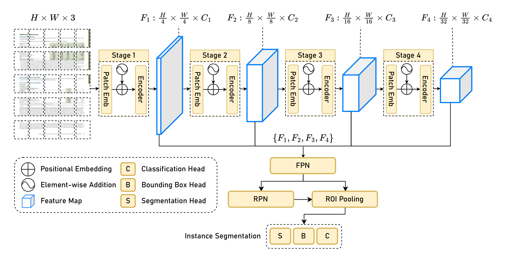
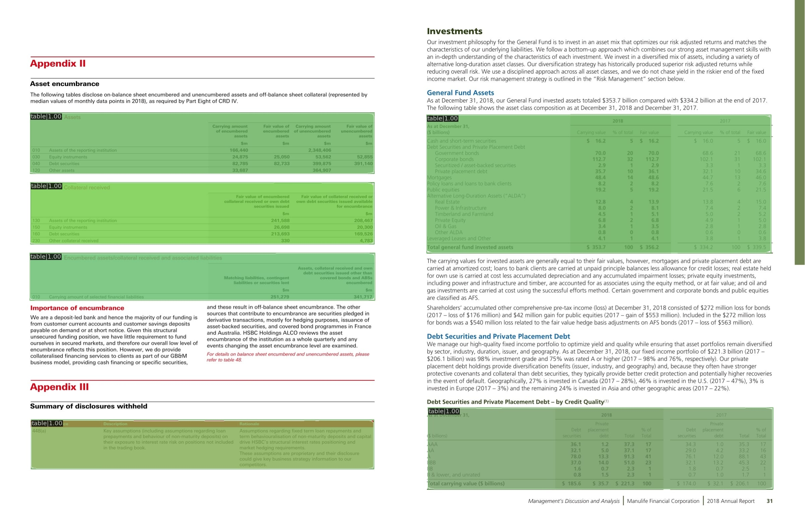
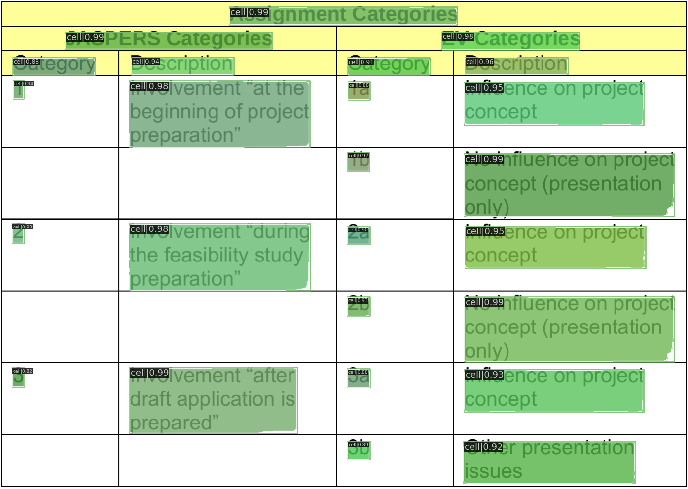

# Model
This directory contains the config and implementation files for the proposed architecture. We have intentionally left out the [augmentation](../augmentation/) files from this directory, as we believe the instructions to use them deserve a separate section.

## Architecture

  
  
Proposed model architecture</p1>

## Results

  
  
Model detection output on ICDAR 2019 cTDaR test set samples</p1>

  
  
Model structure output on ICDAR 2013 sample</p1>

## Acknowledgements
The [MMDetection](https://github.com/open-mmlab/mmdetection) team for creating their amazing framework to push the state of the art computer vision research and enabling us to experiment and build various models very easily.

   

